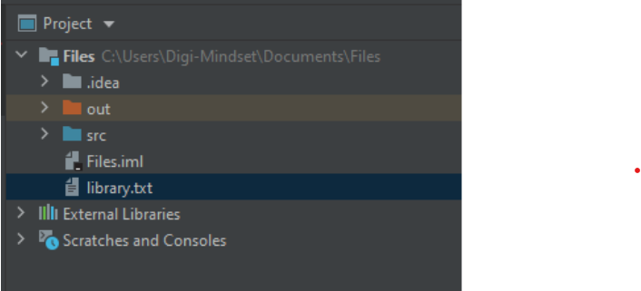

# Dateien aus dem Filesystem auslesen

In den verschiedenen Programmiersprachen gibt es unterschiedliche Methoden/Klassen, die sich mit dem Interagieren mit Dateien beschäftigen. Welche Klasse man wählt hängt in der Regel davon ab, welchen Anwendungsfall man hat:
- wie groß ist die Datei?
- ist der Inhalt der Datei strukturiert und wenn ja nach welchem Format
- muss die Datei unbedingt gleich vollständig ausgelesen werden oder reicht es, wenn man diese Zeile für Zeile ausliest
- sollen nur bestimmte Werte aus der Datei herausextrahiert werden oder immer eine ganze Zeile?
- ...

Da Klassennamen und die Art, wie die Klassen arbeiten je Programmiersprache sehr unterschiedlich sind werden wir in diesem Kapitel je Programmiersprache einen eigenen Kapitel erstellen.

## Java

In Java werden 3 vielverwendete Klassen vorstellen, die sich mit Files beschäftigen und auch ihre Anwendungsgebiete eingehen:
- Scanner
- FileReader
- BufferedFileReader
- Files


### Scanner

Die *java.util.**Scanner***-Klasse ist eine allgemeine Klasse, die darauf abzielt, Inputs der meistverwendeten Art und Weisen zu implementieren. So kennen wir diese Klasse bereits in Bezug auf die Konsoleneingaben. 

```java
new Scanner(System.in);
```

Genauso können damit aber auch Dateien ausgelesen werden. Das hängt mit dem Objekt zusammen, das wir im Konstruktor mitgeben. Für Dateien verwenden wir ein File-Objekt:

```Java
private static void readWithScanner() throws FileNotFoundException {
  File libraryFile = new File("library.txt");
  Scanner fileScanner = new Scanner(libraryFile);
  while (fileScanner.hasNextLine()) {
    System.out.println(fileScanner.nextLine());
  }
  fileScanner.close();
}
```

Im Konstruktor der File-Klasse müssen wir den Pfad (relativ oder absolut) mitgeben. Hier haben wir uns für den relativen Pfad entschieden: *"library.txt"*. 



Der relative Pfad bezieht sich auf den Basispfad des Projekts. In diesem Falle der Ordner: *"C:\User\Digi-Mindset\Documents\Files"*, in dem sich die Datei library.txt befindet.

Anschließend kann ein Scanner mit *fileScanner.hasNextLine()* überprüfen, ob noch eine Zeile vorhanden ist. Man könnte andere Scanner-Methoden verwenden wie *.nextInt()*. Allerdings macht dies die Arbeit mit Files wesentlich schwieriger. Manchmal ist das aber genau der Anwendungsfall, der vorliegt: Zahlen getrennt durch einen Leerzeichen in einer Datei. Dann macht die Nutzung eines Scanners und von *.nextInt()* einen Sinn.

Um die nächste Zeile auszulesen verwendet man die Methode: *fileScanner.nextLine()*.

Die Klasse Scanner wird hier angeführt, weil sie bereits aus vorigen Kapiteln bekannt ist. Allerdings soll diese eher nur dann verwendet werden, wenn
- die speziellen Funktionalitäten von Scanner benötigt werden
- es sich um eine Textdatei (also keine Binaries)
- es sich um eine kleinere Datei handelt

**Referenz**: [Java-Referenz java.util.Scanner](https://docs.oracle.com/en/java/javase/21/docs/api/java.base/java/util/Scanner.html)

### FileReader

Eine weitere weitverbreitete Klasse, um Dateien auszulesen, ist der *java.io.**FileReader***. Diese Klasse ist für den Fall gedacht, einen Stream an Buchstaben auszulesen.

Hier ein Beispiel:

```java
private static void readWithFileReader() throws IOException {
  FileReader reader = new FileReader("library.txt");
  char[] content = new char[100];
  reader.read(content);
  System.out.println(content);
  reader.close();
}
```
FileReader ist für kleinere Dateien gedacht, da das File auf einmal ausgelesen wird. Im Gegensatz zu den anderen vorgestellten Varianten gibt es hier keine Möglichkeit das File Zeile für Zeile auszulesen. 

Hier ist anzumerken:
- Im Constructor wird der Pfad zur Datei (hier auch: relativ oder absolut) angegeben.
- Die Datei wird anhand der Methode **read(Array)** ausgelesen und speichert den gelesenen Inhalt in das Array
- Das FileReader-Objekt muss am Ende durch die **.close()**-Methode geschlossen werden, ansonsten kann nicht mehr in diese Datei geschrieben werden, solange das Programm nicht geschlossen wird.

**Referenz**: [Java-Referenz java.io.FileReader](https://docs.oracle.com/en/java/javase/21/docs/api/java.base/java/io/FileReader.html)

### BufferedReader

Ein guter Weg für große Dateien ist der *java.io.**BufferedReader***. Er ist besonders praktisch für große Dateien, die man nicht auf einmal einlesen möchte auf Grund des hohen Speicherbedarfs. Er ist außerdem praktischer als der FileReader, da es vorgegebene Funktionen für das zeilenweise Lesen gibt, was die häufigste Art des Zugriffs ist.

Um die Einschränkungen des FileReaders umzugehen, kann man den **BufferedReader** verwenden. Dieser ist insbesondere für das Auslesen großer Dateien geeignet, da das File Zeile für Zeile ausgelesen werden kann.

Wie dies funktioniert sehen wir hier:

```java
private static void readWithBufferedReader() throws IOException {
  BufferedReader reader = new BufferedReader(new FileReader("library.txt"));
  String currentLine = reader.readLine();
  while (currentLine != null) {
    System.out.println(currentLine);
    currentLine = reader.readLine();
  }
  reader.close();
}
```

Der BufferedReader bietet uns folgende Methoden an:
- Zuerst muss dem BufferedReader ein Stream übergeben werden. In unserem Beispiel nehmen wir den FileReader vom letzten Beispiel. 
- Das Auslesen eine Zeile erfolgt mit der Methode **.readLine()**, die einen String zurückgibt
- Am Ende muss der BufferedReader wie bei den anderen Klassen mit der **.close()**-Methode geschlossen werden, damit die Datei für andere Anwendungen wieder schreibend geöffnet werden kann.

**Referenz**: [Java-Referenz java.io.BufferedReader](https://docs.oracle.com/en/java/javase/21/docs/api/java.base/java/io/BufferedReader.html)

### Files

Die Klasse java.nio.file.**Files** ist eine Klasse, die statische Operationen auf Dateien, Ordner und andere Typen von Files anbieten. Diese Klasse bietet also mehr Möglichkeiten an, als die oben genannten Klassen. Man könnte sie so betrachten, wie eine Klasse, die alle Möglichkeiten eine File-Explorers bietet: Eine Klasse, die das Kopieren, Erstellen, Löschen von Dateien und Ordnern bietet, ...

In Bezug auf das Auslesen von Dateien bietet diese Klasse:
- die Methode **readAllLines()**, die alle Zeilen einer Datei auf einmal ausliest und eine Liste von Strings liefert.
- die Methode **lines()**, die zwar alle Zeilen einer Datei ausliest allerdings im Lazy-Modus, sodass jede Zeile erst zu dem Zeitpunkt ausgelesen wird, als sich gebraucht wird. Das ist besonders für große Dateien sehr gut geeignet.

Wichtig ist zu wissen, dass als Parameter keinen Pfad als String mitgegeben wird, sondern ein Objekt vom Typ **Path**!

Folgende Beispiele zeigen, wie diese 2 Methoden verwendet werden bzw. ein Object vom Typ Path erstellt:

```java
private static void readWholeFileWithFilesClass() throws IOException {
  List<String> allLines = Files.readAllLines(Paths.get("library.txt"));
  for (String line : allLines) {
    System.out.println(line);
  }
}
```

```java
private static void readSomeLinesWithFilesClass() throws IOException {
  Stream<String> allLines = Files.lines(Paths.get("library.txt"));
  allLines.skip(3L)
          .forEach(line -> System.out.println(line)); //Die jeweilige Zeile wird erst jetzt aus dem File gelesen
  allLines.close();
}
```

**Referenz**: [Java-Referenz java.nio.file.Files](https://docs.oracle.com/javase/21/docs/api/java/nio/file/Files.html)

## C#

```c#

```

Zurück zur [Startseite](README.md)
